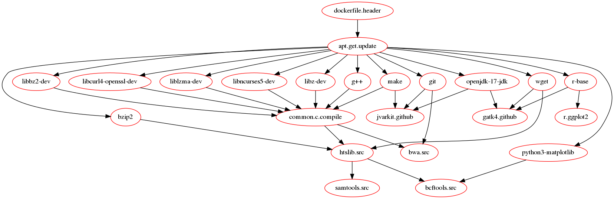

# biocontainers

The idea of this repository is to create [Docker containers](https://www.docker.com/) for **bioinformatics** 'a la carte' using a simple [Makefile](https://www.gnu.org/software/make/manual/make.html) that is used as a recipe to install softwares and their depedencies.

Here the **make** file `recipes.mk` contains the recipes to build a few common softwares used in bioinformatics.
But instead of using the usual `SHELL=sh` we use a short script `make/docker.run` that is going to echo the command with a prefix `RUN `.

For example if we want to build a docker container with **samtools** and **bcftools**, we can invoke `make` the following way:

```shell
$ make  -f make/recipes.mk  HTS_VERSION=1.20 samtools.src bcftools.src 
```

the graph of dependencies is the following one (to compile bcftools we need wget , to get wget we need to run apt-get , etc...)

```


                                                                                                       ┌──────┐
  ┌─────────────────────────────────────────────────────────────────────────────────────────────────── │ wget │ ◀┐
  │                                                                                                    └──────┘  │
  │                                                                                                              │
  │    ┌────────────────────────────────────────────────────────────────────────────┐                            │
  │    │                                                                            │                            │
  │    │                                                     ┌───────────────────┐  │  ┌──────────────┐          │
  │    │                                                     │ dockerfile.header │  │  │    bzip2     │ ─────────┼──────────────────────────────────────┐
  │    │                                                     └───────────────────┘  │  └──────────────┘          │                                      │
  │    │                                                       │                    │    ▲                       │                                      │
  │    │                                                       │                    │    │                       │                                      │
  │    ▼                                                       ▼                    │    │                       │                                      │
  │  ┌────────────────────┐     ┌──────────────────────┐     ┌───────────────────────────────────────────────────────────────┐     ┌─────────────────┐  │
  │  │ python3-matplotlib │     │ libcurl4-openssl-dev │ ◀── │                                                               │ ──▶ │ libncurses5-dev │  │
  │  └────────────────────┘     └──────────────────────┘     │                                                               │     └─────────────────┘  │
  │    │                          │                          │                                                               │       │                  │
  │    │                          │                          │                        apt.get.update                         │       │                  │
  │    │                          │                          │                                                               │       │                  │
  │    │                          │                          │                                                               │       │                  │
  │    │                          │                       ┌─ │                                                               │ ─┐    │                  │
  │    │                          │                       │  └───────────────────────────────────────────────────────────────┘  │    │                  │
  │    │                          │                       │    │                         │                       │              │    │                  │
  │    │                          │                       │    │                         │                       │              │    │                  │
  │    │                          │                       │    ▼                         ▼                       ▼              │    │                  │
  │    │                          │                       │  ┌───────────────────┐     ┌──────────────┐        ┌─────────────┐  │    │                  │
  │    │                          │                       │  │    libbz2-dev     │     │      g       │        │ liblzma-dev │  │    │                  │
  │    │                          │                       │  └───────────────────┘     └──────────────┘        └─────────────┘  │    │                  │
  │    │                          │                       │    │                         │                       │              │    │                  │
  │    │                     ┌────┼───────────────────────┘    │                         │                       │              │    │                  │
  │    │                     │    │                            ▼                         ▼                       │              │    │                  │
  │    │                     │    │                          ┌────────────────────────────────────────┐          │              │    │                  │
  │    │                     │    └────────────────────────▶ │                                        │ ◀────────┘              │    │                  │
  │    │                     │                               │                                        │                         │    │                  │
  │    │                     │                               │                                        │                         │    │                  │
  │    │                     │                               │            common.c.compile            │ ◀───────────────────────┼────┘                  │
  │    │                     │                               │                                        │                         │                       │
  │    │                     │  ┌──────────────────────┐     │                                        │                         │                       │
  │    │                     └▶ │         make         │ ──▶ │                                        │ ◀────────┐              │                       │
  │    │                        └──────────────────────┘     └────────────────────────────────────────┘          │              │                       │
  │    │                                                       │                                                 │              │                       │
  │    │                                                       │                                                 │              │                       │
  │    │                                                       ▼                                                 │              │                       │
  │    │                                                     ┌────────────────────────────────────────┐          │              │                       │
  │    │                                                     │               htslib.src               │ ◀────────┼──────────────┼───────────────────────┘
  │    │                                                     └────────────────────────────────────────┘          │              │
  │    │                                                       │                    ▲    │                       │              │
  │    │                                                       │                    │    │                       │              │
  │    │                                                       ▼                    │    ▼                       │              │
  │    │                                                     ┌───────────────────┐  │  ┌──────────────┐          │              │
  │    └───────────────────────────────────────────────────▶ │   bcftools.src    │  │  │ samtools.src │          │              │
  │                                                          └───────────────────┘  │  └──────────────┘          │              │
  │                                                                                 │                            │              │
  └─────────────────────────────────────────────────────────────────────────────────┘                            │              │
                                                                                                                 │              │
                                                             ┌───────────────────┐                               │              │
                                                             │     libz-dev      │ ──────────────────────────────┘              │
                                                             └───────────────────┘                                              │
                                                               ▲                                                                │
                                                               └────────────────────────────────────────────────────────────────┘

```

'make' prints

```Dockerfile
FROM ubuntu:22.04
# update apt
RUN apt-get -y update
RUN DEBIAN_FRONTEND=noninteractive TZ=Etc/UTC  apt-get -y install wget
RUN DEBIAN_FRONTEND=noninteractive TZ=Etc/UTC  apt-get -y install make
RUN DEBIAN_FRONTEND=noninteractive TZ=Etc/UTC  apt-get -y install libz-dev
RUN DEBIAN_FRONTEND=noninteractive TZ=Etc/UTC  apt-get -y install libbz2-dev
RUN DEBIAN_FRONTEND=noninteractive TZ=Etc/UTC  apt-get -y install g++
RUN DEBIAN_FRONTEND=noninteractive TZ=Etc/UTC  apt-get -y install liblzma-dev
RUN DEBIAN_FRONTEND=noninteractive TZ=Etc/UTC  apt-get -y install libcurl4-openssl-dev
RUN DEBIAN_FRONTEND=noninteractive TZ=Etc/UTC  apt-get -y install libncurses5-dev
RUN DEBIAN_FRONTEND=noninteractive TZ=Etc/UTC  apt-get -y install bzip2
RUN cd /opt/ && \
	wget -O htslib-1.20.tar.bz2 "https://github.com/samtools/htslib/releases/download/1.20/htslib-1.20.tar.bz2" && \
	tar xvfj htslib-1.20.tar.bz2 && \
	cd htslib-1.20 && \
	make && \
	rm ../htslib-1.20.tar.bz2
ENV PATH=/opt/htslib-1.20:${PATH}
RUN cd /opt/ && \
	wget -O samtools-1.20.tar.bz2 "https://github.com/samtools/samtools/releases/download/1.20/samtools-1.20.tar.bz2" && \
	tar xvfj samtools-1.20.tar.bz2 && \
	cd samtools-1.20 && \
	make HTSDIR=/opt/htslib-1.20 && \
	rm ../samtools-1.20.tar.bz2
ENV PATH=/opt/samtools-1.20:${PATH}
RUN DEBIAN_FRONTEND=noninteractive TZ=Etc/UTC  apt-get -y install python3-matplotlib
RUN cd /opt/ && \
	wget -O bcftools-1.20.tar.bz2 "https://github.com/samtools/bcftools/releases/download/1.20/bcftools-1.20.tar.bz2" && \
	tar xvfj bcftools-1.20.tar.bz2 && \
	cd bcftools-1.20 && \
	make HTSDIR=/opt/htslib-1.20 && \
	rm ../bcftools-1.20.tar.bz2
ENV PATH=/opt/bcftools-1.20:${PATH}
ENV BCFTOOLS_PLUGINS=/opt/bcftools-1.20/plugins
```


 
and this output can be piped into `docker build`

```shell
make  -f make/recipes.mk  HTS_VERSION=1.20 samtools.src bcftools.src  |\
    BUILDKIT_PROGRESS=plain docker build -t bioinfo1 -


#1 [internal] load .dockerignore
#1 transferring context: 2B done
#1 DONE 0.6s
(...)
#5 [ 1/15] FROM docker.io/library/ubuntu:22.04@sha256:1b8d8ff4777f36f19bfe73ee4df61e3a0b789caeff29caa019539ec7c9a57f95
#6 [ 2/15] RUN apt-get -y update
#7 [ 3/15] RUN DEBIAN_FRONTEND=noninteractive TZ=Etc/UTC  apt-get -y install wget
#8 [ 4/15] RUN DEBIAN_FRONTEND=noninteractive TZ=Etc/UTC  apt-get -y install make
#9 [ 5/15] RUN DEBIAN_FRONTEND=noninteractive TZ=Etc/UTC  apt-get -y install libz-dev
#10 [ 6/15] RUN DEBIAN_FRONTEND=noninteractive TZ=Etc/UTC  apt-get -y install libbz2-dev
#11 [ 7/15] RUN DEBIAN_FRONTEND=noninteractive TZ=Etc/UTC  apt-get -y install g++
#12 [ 8/15] RUN DEBIAN_FRONTEND=noninteractive TZ=Etc/UTC  apt-get -y install liblzma-dev
#13 [ 9/15] RUN DEBIAN_FRONTEND=noninteractive TZ=Etc/UTC  apt-get -y install libcurl4-openssl-dev
#14 [10/15] RUN DEBIAN_FRONTEND=noninteractive TZ=Etc/UTC  apt-get -y install libncurses5-dev
#15 [11/15] RUN DEBIAN_FRONTEND=noninteractive TZ=Etc/UTC  apt-get -y install bzip2
#16 [12/15] RUN cd /opt/ && 	wget -O htslib-1.20.tar.bz2 "https://github.com/samtools/htslib/releases/download/1.20/htslib-1.20.tar.bz2" && 	tar xvfj htslib-1.20.tar.bz2 && 	cd htslib-1.20 && 	make && 	rm ../htslib-1.20.tar.bz2
#16 1.275 --2024-04-19 12:20:00--  https://github.com/samtools/htslib/releases/download/1.20/htslib-1.20.tar.bz2
#17 [13/15] RUN cd /opt/ && 	wget -O samtools-1.20.tar.bz2 "https://github.com/samtools/samtools/releases/download/1.20/samtools-1.20.tar.bz2" && 	tar xvfj samtools-1.20.tar.bz2 && 	cd samtools-1.20 && 	make HTSDIR=/opt/htslib-1.20 && 	rm ../samtools-1.20.tar.bz2
(...)
#20 exporting to image
#20 exporting layers
#20 exporting layers 30.4s done
#20 writing image sha256:8ad7f204b6cf3af52764993fa94c5249af1b0d635c3de05932cec260cbe65257 0.0s done
#20 naming to docker.io/library/bioinfo1
#20 naming to docker.io/library/bioinfo1 0.1s done
#20 DONE 30.5s
```

Another example:

```bash
make -nBd -f make/recipes.mk r.ggplot2  bwa.src gatk4.github  jvarkit.github samtools.src bcftools.src jvarkit.github 
```




# Author

Pierre Lindenbaum PhD. Institut du Thorax. Nantes. France


